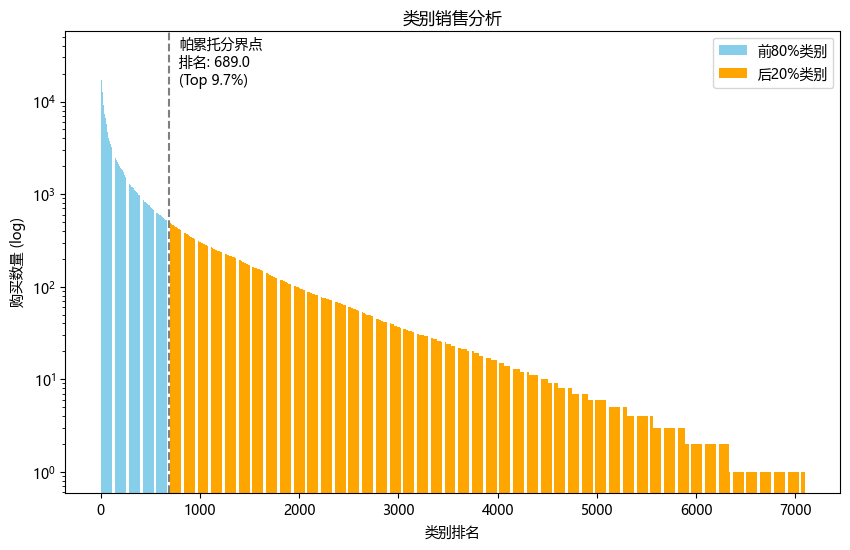
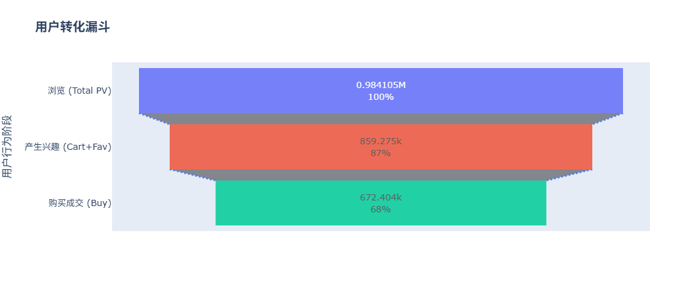
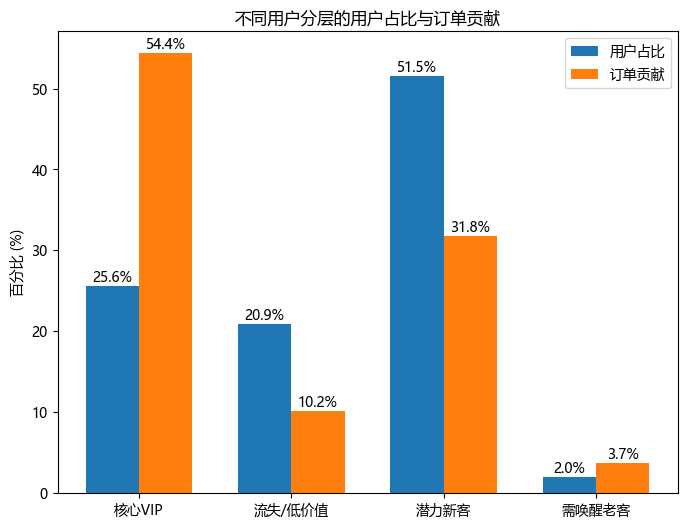
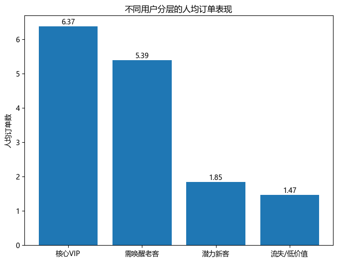
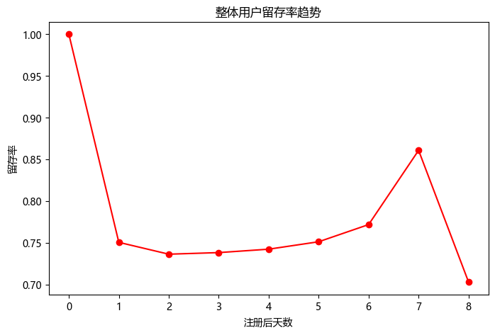
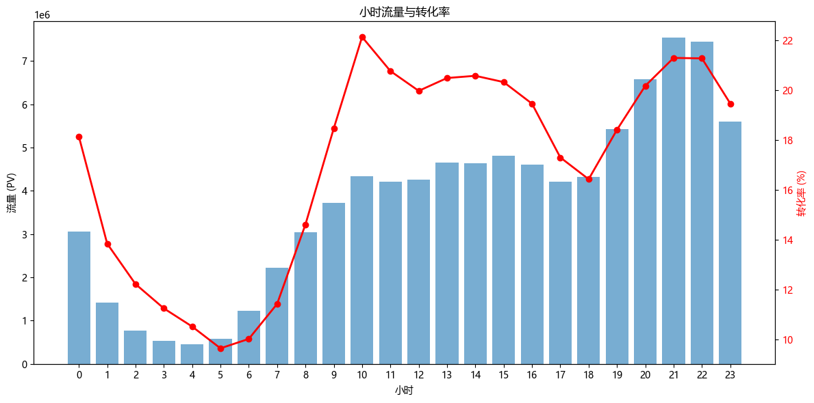

# 🛒 亿级电商用户行为分析与增长策略报告

    

## 📊  1. 项目背景与目标
本项目基于 **阿里巴巴天池** 公开的真实用户行为数据集，模拟海量数据场景下的业务分析与策略制定。

* **数据来源**: [User Behavior Data from Taobao for Recommendation](https://tianchi.aliyun.com/dataset/649)
* **时间窗口**: 2017年11月25日 - 2017年12月03日 (共 9 天)
* **数据规模**: 约 **1 亿条 (100,150,807)** 原始记录
* **字段说明**:
    * `user_id`: 用户唯一标识
    * `item_id`: 商品唯一标识
    * `category_id`: 商品所属品类 ID
    * `behavior_type`: 用户行为类型（包含 pv 浏览，fav 收藏， cart 加购， buy 购买）
    * `timestamp`: 行为时间戳

---

## 🛠️ 2. 技术栈与工程化挑战
面对 1 亿行原始数据，单机内存 (RAM) 无法直接加载。本项目采用了以下措施：

* **ETL 管道设计 (Python)**:
    * **分块流式处理**: 利用 Pandas `chunksize=100000` 结合 `SQLAlchemy`，将数据分批清洗并流式写入数据库，有效避免内存溢出 (OOM)。
    * **预计算字段**: 在 Python 内存层完成时间戳 (Timestamp) 到日期 (Datetime) 的格式转换，降低数据库层面的计算负载。
* **数据库性能调优 (MySQL)**:
    * **Load-Then-Index 策略**: 采用“先裸表写入，后重建索引”的策略，最大化写入吞吐量。
    * **B-Tree 索引体系**: 针对高频查询字段建立联合索引，减少聚合查询时间。

---

## 💡 3. 核心商业洞察

### 📈 3.1 市场格局：高市场集中度分析
> **分析维度**: 评估平台 GMV (商品交易总额) 的品类贡献分布结构。

* **数据发现**:
    * **极度偏态分布**: 通过累计分布函数分析验证，市场呈现极高的集中度。仅 **9.7% (689个)** 的头部品类贡献了平台 **80%** 的总销量。
    * **长尾效应验证**: 剩余 90.3% 的品类虽然SKU基数庞大，但仅贡献 20% 的交易额，符合典型的**长尾分布** 特征。
* **策略建议**:
    * **资源配置**: 建议将 80% 的供应链优化资源与运营预算向 **高贡献核心品类 (Top 10%)** 倾斜，保障核心供给稳定性。
    * **长尾管理**: 针对长尾品类，建议采用 **自动化推荐分发** 模式，通过算法匹配细分需求，以降低人工运营成本。




---

### 📉 3.2 转化漏斗：流量质量与瓶颈诊断
> **分析维度**: 评估用户从浏览到支付的全链路转化效率。

* **数据发现**:
    * **高用户粘性**: 在统计周期内，**人均页面访问量** 累计达到 **91页** (日均 ~10页)；**UV 转化率高达 68.3%**。各项指标均证实该数据集用户具备极高的活跃度与购买意向。
    * **转化瓶颈**: 尽管购买意愿高，但在 **兴趣行为（加购+收藏） -> 支付** 环节仍存在 **21.8%** 的流失率（涉及约 18.6万 高意向用户）。
* **策略建议**:
    * **运营重心调整**: 鉴于流量精准度高，运营目标应从提升转化率转向 **提升客单价** 与 **连带购买率**。
    * **流失召回**: 针对支付环节流失用户，建议实施 **精准营销触达**，如库存预警或限时优惠推送，以减少高意向客户的流失。


---

### 👥 3.3 用户价值：基于动态阈值的 RFM 分层
> **分析维度**: 基于用户消费频次与最近一次消费时间的价值分层。

* **数据发现 (Data Findings)**:
    * **头部贡献显著**: **核心 VIP 用户** (Recency $\le$ 4, Frequency $\ge$ 4) 占总人数的 **25.6%**，贡献了全站 **54.4%** 的订单量。高价值用户仍对业务贡献显著，应作为重点运营人群。
    * **腰部力量**: **潜力新客** (Recency $\le$ 4, Frequency < 4) 占比最高 (**51.5%**)，贡献了 **31.8%** 的订单。这说明平台不完全依赖 VIP，腰部用户活跃度依然可观。
    * **高价值流失预警**: 识别出 **2.0%** 的“需唤醒老客”。这部分人均订单量高达 **5.4单** (接近 VIP 水平)，说明该群体历史消费能力较强，一旦成功召回，具有较高的潜在价值，是优先考虑的高潜回流人群。
* **策略建议**:
    * **分层运营**: 针对 VIP 用户侧重 **“权益维持”**；针对潜力新客（腰部）侧重 **“提频策略”**（如连带率推荐），只需将这 56% 用户的频次提升 1 次，整体 GMV 将有质的飞跃。




---

### 🔄 3.4 留存分析：双十二预热与周度回流
> **分析维度**: 用户活跃周期的衰减与回流特征。

* **数据发现**:
    * **U型回升趋势**: 总体留存曲线呈现显著的U型回升趋势。
    * **双重效应叠加**:
        * **Day 6 (12月1日)**: 留存率开始止跌回升，与 **双十二大促预热** 开启时间吻合。
        * **Day 7 (12月2日)**: 受“大促预热”与“周六效应”的双重驱动，留存率达到 **86%** 的峰值。
    * *数据效度说明*: Day 8 (12月3日) 的数据大幅下降属于 **数据截断** 现象（部分用户当日行为未被完整记录），不代表真实流失。
* **策略建议**:
    * **活动节奏**: 验证了“大促预热期”对用户留存的显著拉升作用。建议在未来运营中，将活动预热期锁定在 **周五至周日**，利用自然流量与活动热度的共振效应最大化留存。




---

### ⏰ 3.5 时段分析：流量与效率的双峰特征 
> **分析维度**: 不同时段的流量规模与转化效率的关系。

* **数据发现**:
    * **流量/效率错位**:
        * **21:00**: 全天 **流量峰值**，用户行为以浏览为主，决策较慢。
        * **10:00**: 全天 **转化效率峰值**，转化率 > 22%，用户购买决策路径最短，购买目的性最强。
* **策略建议**:
    * **分时段运营**: 实施差异化投放策略——**早间 (10:00)** 侧重高转化单品推送（如秒杀），利用高 CVR 快速出货；**晚间 (21:00)** 侧重内容种草与直播，以最大化流量利用率和用户停留时长。



---

## 📂 项目结构 (File Structure)

```text
project-root/
├── code/
│   ├── data_gen_ali.sql   # 建表
│   ├── analysis.ipynb      # Python 数据清洗、分析脚本
├── images/                     # README 图表资源
│   ├── pareto.png
│   ├── funnel.png
│   ├── RFM_cust.png
│   ├── RFM_order_cust.png
│   ├── retention.png
│   ├── pv_rep.png
└── README.md                   # 项目报告
```
